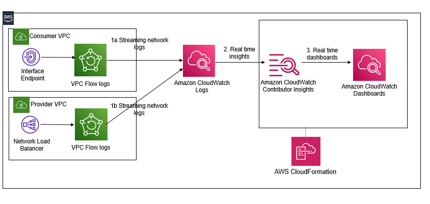

# Automate time series network monitoring and visualizations of AWS PrivateLink using Amazon CloudWatch Contributor Insights

## Overview

1. Time-series monitoring and visualization for PrivateLink connections using CloudWatch Contributor Insights automation
2. Sets up custom Amazon CloudWatch dashboards, Amazon CloudWatch metrics, and Amazon CloudWatch alarms based on Contributor Insights rules. These rules monitor several aspects of PrivateLink connections such as bytes transferred by source and destination IP address, traffic by source address and action or top sources for rejected TCP connections. You can modify the solution to add additional/custom rules.

## Solution Design

## Prerequisites

1. A PrivateLink connection. 
	1. If you want to test this solution, then you can also set up an end to end PrivateLink from our [AWS Networking Workshop](https://networking.workshop.aws/) by completing Lab #5.
		1. Note the identifiers of your elastic network interfaces that were provisioned for the VPC endpoint and the NLB for your VPC Endpoint service. 
			1. In the Immersion day, the VPC endpoint is created in your consumer VPC (NP1 VPC) for the Endpoint Service deployed in the provider VPC (NP2 VPC) and the VPC Endpoint service uses the ‘tgw-NP2-NLB’ NLB in the NP2 VPC.
2. Set up VPC Flow Logs and publish flow logs to CloudWatch Logs
	1. In the Immersion day workshop PrivateLink,  do this for both the NP1 VPC and the NP2 VPC. Note the name of the CloudWatch Log group for the VPC Flow Log for the NP1 VPC as well as for the NP2 VPC.

## Install

1. 1-click automation. Launch the **[aws-privatelink-cloudwatchcontributorinsights.yml](https://github.com/aws-samples/aws-cloudwatch-monitoring/blob/main/cft/aws-privatelink-cloudwatchcontributorinsights.yml)** template. Provide input parameters:
	1. Network Interface ID of any one of the elastic network interfaces for the VPC endpoint.
	2. Network Interface ID of any one of the elastic network interfaces for the Network Load Balancer used by the VPC Endpoint service. 
	3. Name of the CloudWatch Log group configured for the VPC Flow Logs for the consumer VPC.
	4. Name of the CloudWatch Log group for the VPC Flow Log for the provider VPC. This is NP2 VPC from Step 2 in the prerequisites section. 
	5. Email address where you can receive notifications and any name for the SNS topic used by CloudWatch Alarms.

## Validate

1.	Set up DNS alias - Create an Amazon Route53 DNS entry for the VPC Endpoint. 
	1. For the sample VPC PrivateLink from the workshop, you can do that here based on the lab instructions (Lab #5). Your DNS record web.np1.aws. example.com should be associated with an alias to the DNS name created for the endpoint, which starts with vpce and ends with amazonaws.com.
2.	Generate traffic
	1.  For the sample VPC PrivateLink from the workshop, you can simply ssh to the ‘NP1-tgw-Server’ and hit the target web applications from your VPC Endpoint every two seconds- *watch -n 2 "curl web.np1.aws.example.com -s"*. In the response from the target web applications, you should see a message from the target web application behind the NLB indicating their private IP address.
3.	Access your Contributor Insights PrivateLink dashboard in CloudWatch- The *PrivateLinkContributorInsights* to visualize bytes transferred or total connections from source/destination ip for PrivateLink
4. View your Cloudwatch metrics and alarms- From the CloudWatch console, select All alarms. In the filter panel, search using the ‘PrivateLink’ keyword and you should see two CloudWatch Alarms, PrivateLinkHighBytesTransferAlarm and PrivateLinkRejectConnectionsAlarm and visualize cloudwatch metrics

